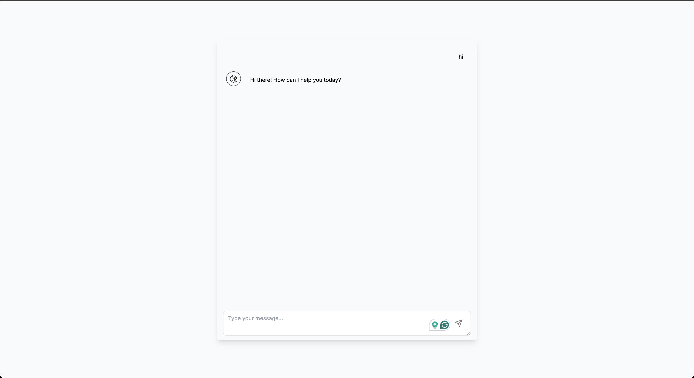

# 🤖 AI Chatbot with Gemini API

An interactive AI-powered chatbot built using **Next.js**, **TypeScript**, and the **Gemini API** by Google. The app delivers real-time streaming responses with a clean, responsive UI — perfect for experimenting with generative AI in modern web apps.



---

## 🚀 Features

- 🔮 Real-time streaming responses from **Google Gemini API**
- ⚡ Built with **Next.js App Router** and **TypeScript**
- 💬 Supports multi-turn conversations
- 🌐 Clean, responsive UI with modern styling
- 🧠 Handles assistant and user messages dynamically
- 🔐 Secure API route integration with Gemini

---

## 🛠️ Tech Stack

- **Next.js (App Router)**
- **TypeScript**
- **Google Gemini API**
- **Tailwind CSS** (or your UI framework)
- **Vercel** for deployment

---

## 📦 Getting Started

Clone the project and install dependencies:

```bash
git clone https://github.com/yourusername/your-chatbot-repo.git
cd your-chatbot-repo
npm install
